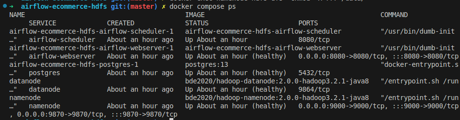
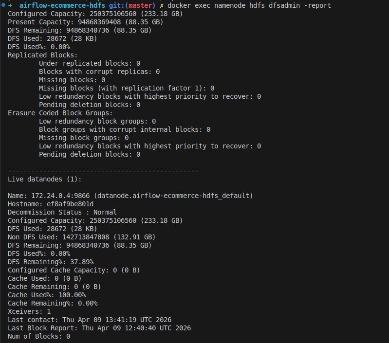

## Q1 — HDFS vs système de fichiers local
### Pourquoi ne pas simplement stocker les logs sur le disque local du serveur Airflow ou sur un NFS ? Listez 3 avantages concrets de HDFS pour un cas d’usage de 50 Go/jour de logs, en vous appuyant sur les caractéristiques du système (distribution, réplication, localité des données).
Stocker en local ou sur un NFS poserait des limites en scalabilité Pour un cas d’usage de 50 Go jour HDFS a plusieurs avantages Il offre une meilleure scalabilité car les données sont réparties sur plusieurs machines et il est tolérant aux pannes car il y a plusieurs copies des données

## Q2 — NameNode, point de défaillance unique (SPOF)
### Dans l’architecture HDFS, le NameNode est un SPOF. Si le NameNode tombe, que se passe-t-il pour les DataNodes et pour les clients ? Quels mécanismes Hadoop propose-t-il pour pallier ce problème en production (HDFS NameNode HA) ? Quel est le rôle du Journal Node dans cette architecture haute disponibilité ?
Si un NameNode tombe les clients ne pourront plus accéder aux données Dans ce cas HDFS HA permet à un NameNode actif ou standby de prendre le relais automatiquement Le Journal Node permet de logger les modifications et de synchroniser les NameNodes pour assurer une cohérence des données

## Q3 — HdfsSensor vs polling actif
### Comparez le HdfsSensor en mode poke et en mode reschedule . Dans quel cas utiliseriez-vous l’un plutôt que l’autre ? Quel est l’impact sur le nombre de slots de workers Airflow disponibles ? Proposez un scénario concret où le mauvais choix de mode bloquerait tout le scheduler.
Le mode poke vérifie en boucle en bloquant le worker cest préférable de lutiliser lorsquon a une attente courte Le mode reschedule libère le worker après la vérification ce qui est plus optimisé pour une attente longue Limpact du mode poke sur les workers est quil peut les saturer et celui du mode reschedule offre une meilleure gestion des ressources Un scénario concret qui bloquerait tout le scheduler pourrait être un grand nombre de sensors en mode poke qui attendent la création dun fichier et qui entraînent un blocage de tous les workers et donc plus aucune tâche ne sexécute

## Q4 — Réplication HDFS et cohérence des données
### Dans le hadoop.env , on a HDFS_CONF_dfs_replication=1 (réplication minimale). En production avec un facteur de réplication de 3, expliquez ce qui se passe lors de l’écriture d’un bloc de 128 Mo : combien de copies sont écrites, sur combien de DataNodes, et dans quel ordre ? Que garantit HDFS en termes de cohérence lors d’une lecture concurrente (pendant que l’écriture est en cours) ?
Avec un facteur de réplication de 3 3 copies seront écrites stockées sur 3 DataNodes différents HDFS garantit qu’en cas de lecture concurrente le fichier ne soit pas visible complètement afin qu’on ne lise pas des données corrompues

docker compose ps :

docker exec namenode hdfs dfsadmin -report :

